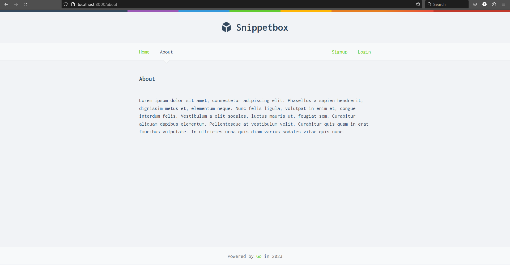

# snippetbox

Snippetbox - Fullstack application that lets you to create and share snippets of text.

## Technologies used

- go-chi/chi
- stretchr/testify
- mysql
- Docker and docker-compose


## Screenshots

About page:




Signup page:


Login page:


Create snippet page:


View snippet page:


Update password page:


## How to Run


```
docker-compose up --build
```
